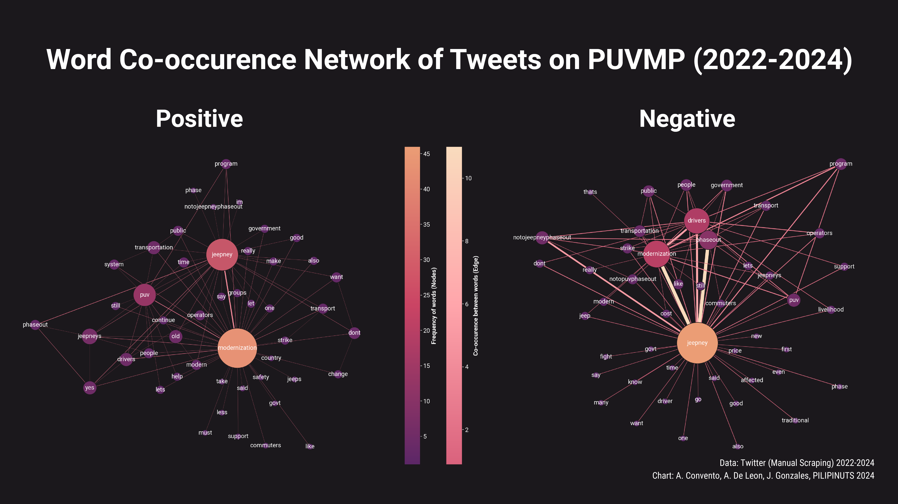
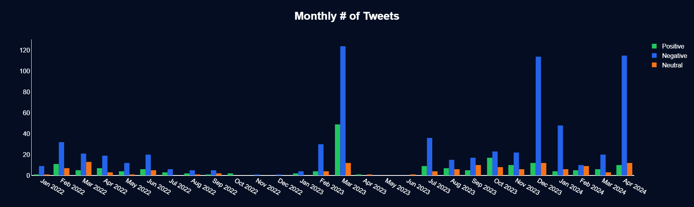
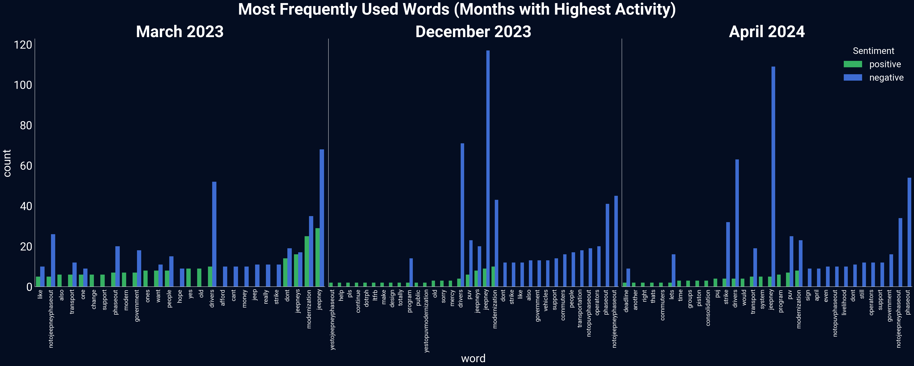

# \#JeepneyNation

Our project, Twitter Analysis on the PUV Modernization Program, aims to study Twitter data related to the issue. It attempts to analyze and understand the general opinion and perspective of people about the PUV Modernization Program.

## Overview

The PUV Modernization Program has been one of the relevant issues in the Philippines. Not only has it affected PUV drivers, but also commuters which encompasses the majority of the people. Numerous strikes were held in hopes of the government and drivers to have an agreement regarding this, which affected commuters. With this, we have decided to study the general reaction of the people regarding the issue which can provide insights on how the program is perceived by them.

## Problem

### Background

On June 19 2017, the Department of Transportation (DOTr) issued Department Order No. 2017-011, otherwise known as the Omnibus Guidelines on the Planning and Identification of Public Road Transportation Services and Franchise Issuance which launched the PUVMP (Public Utility Vehicle Modernization Program).

The program aims to transform the road sector of public transport through the introduction of safer and climate-friendly vehicles, improved regulation, and industry consolidation. The program is beneficial in the long run however operators are caught in a difficult situation due to the high cost of the program. According to the Office of Transportation Cooperatives, jeepney operators must raise P300,000 in paid-up capital. Operators may have to spend between P20,000 to P30,000 each to comply with other requirements. Under the Omnibus Franchising Guidelines, cooperatives and corporations will also be required to eventually upgrade their fleet into modern jeepneys, which can cost up to P2.5 million per unit.

The program would surely improve public transportation however, jeepney drivers and operators – who already subsist on low wages – must then work to pay off millions in debt and interest.

### Research Question

> What is the general attitude of the population regarding the PUV Modernization Program?

#### Null Hypothesis

There is no significant difference in the attitude of the population about the PUV Modernization Program.

#### Alternative Hypothesis

There is a significant difference in the attitude of the population about the PUV Modernization Program.

### Action Plan

> Analyze social media sentiment through tweets to understand public opinion on the PUV Modernization Program.

## Materials and Methods

### Collection

Due to recent modifications to X/Twitter's API, the data collection tool SNScrape has exhibited limitations in retrieving data effectively. So instead, we employed a manual Twitter scraping approach targeting a minimum of 1000 tweets from 2022 to the present (2024) encompassing keywords directly relevant to the research topic.

### Pre-processing

Collected tweets underwent rigorous pre-processing to ensure quality. This includes removing duplicates, non-text content, and formatting inconsistencies. The pre-processed data also underwent validation checks to ensure consistency and adherence to the defined criteria for inclusion.

### Exploration

After collection and pre-processing, the data will undergo exploratory analysis to gain insights into tweet content, distribution of keywords, and potential presence of outliers. This initial exploration will inform subsequent data cleaning and analysis strategies.

### Keywords

1. electric
2. jeep
3. jeepney
4. jeepney modernization
5. jeepney phaseout
6. modern
7. modernisasyon
8. modernization
9. phaseout
10. puv
11. puv modernization
12. puv phaseout
13. strike

### Natural Language Processing

The tweets were processed using Natural Language Processing (NLP) techniques. However, due to the Filipino language content, additional steps were required:

1. **Translation**: The Filipino content was translated into English using GoogleTrans. This was necessary to ensure the accuracy of the subsequent NLP steps.
2. **Manual Checking**: The translated content was manually checked to ensure the accuracy of the translation. This was important to maintain the context and meaning of the original content.

#### Cleaning the Filipino Tweets

The Filipino content required additional cleaning to improve the accuracy of the translation. This involved:

1. **Changing Filipino Slang**: Filipino slang and shorthand were converted into formal words to improve the accuracy of the translation.
2. **Tokenization**: Tweets are broken down into words or phrases according to what's more appropriate for the analysis.

#### Translating the Tweets

GoogleTrans was used to translate the cleaned Filipino content into English. The translated content was then further cleaned by:

1. **Lowercasing**: All the translated content was converted to lowercase to maintain consistency.
2. **Removing Punctuation Marks**: All punctuation marks were removed from the translated content to simplify the subsequent NLP steps.

#### Manual Correction of the Translation

The translated tweets was manually checked and corrected to improve the context accuracy, fix erroneous spacing, and catch mistakes. The manually corrected tweets was then used in the subsequent analysis.

### Visualization

Effective communication of research findings extends beyond mere textual presentation. Recognizing this, we leveraged the power of data visualization to transform our insights into readily comprehensible graphs and charts. This visual approach fosters a clear understanding of the data for a broader audience.

#### Frequency of Tweets about Jeepney Modernization

The frequency of tweets about jeepney modernization in the Philippines saw a distinct peak in **March 2023**. This initial surge subsided, but the conversation reignited in **December 2023** as the deadline for jeepney modernization loomed on December 31st. The subsequent extension of the deadline to **April 2024** triggered another rise in tweet frequency.

#### NLP Word Frequency Visualization

Building on the previous graph that highlighted peak tweet volume in March 2023, December 2023, and April 2024, this NLP Word Frequency Visualization delves deeper into the sentiment expressed during those periods. Notably, March 2023 appears to have a higher concentration of positive terms compared to the other months. However, negative sentiment regarding jeepney modernization is also evident, with terms like "no to jeepney phaseout" standing out.

### Testing

Following data visualization, we employed the Chi Squared Test of Independence to test if the tweet sentiment is affected by time.

- Null hypothesis (H0): The ratio of positive to negative tweets is constant throughout the study period. (Tweet sentiment is independent of time)
- Alternative hypothesis (Ha): The ratio of positive to negative tweets significantly changes throughout the study period. (Tweet sentiment is dependent on time)

We formed groups of 5 for the number of tweets per sentiment per month to meet the requirement of the statement: (`observed >= 5`)

- Chi-Square Statistic: `14.120520497226948`
- P-value: `0.014861708645671878`
- Degrees of Freedom: `5`
- Expected Frequency: `[[ 24.82399103 96.17600897] [ 10.25784753 39.74215247] [ 44.10874439 170.89125561] [ 13.95067265 54.04932735] [ 55.80269058 216.19730942] [ 34.05605381 131.94394619]]`
- Decision: p<=0.05, **Reject Null Hypothesis**
